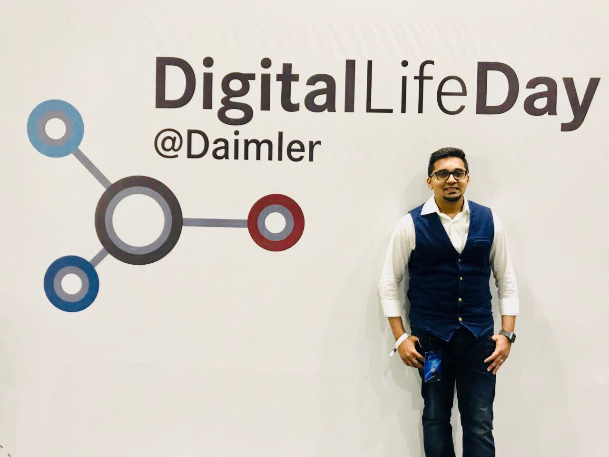
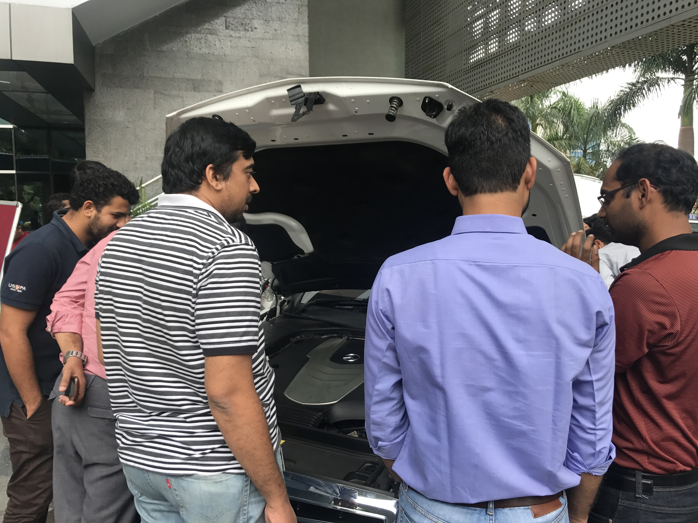
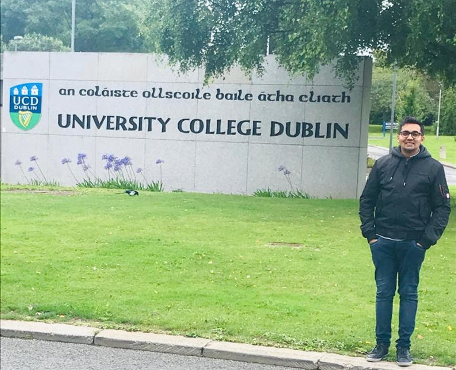

##### I. Who am I?
Greetings! My name is Kiran Siddeshwar, and this will be my portal to share my projects with the world! I dedicate this page to speak a little bit about myself, and share some insight into why I'm doing whatever that I'm doing.

I was born and raised in Bangalore, India, a place well recognised by the whole world as "The Silicon Valley of India". Having graduated with a Bachelors' in Mechanical Engineering from one of the best private institutes in the country: BMS College of Engineering, I ended up working in Mercedes-Benz R&D India. This was a dream come true for a student in a country where talent is in abundance and competition is almost crippling. I then chose to upskill myself by doing my Post-graduation in Data & Computational Science in UCD, Ireland.

##### II. Under-graduation
- My love of Math and Physics led me to choose Mechanical Engineering. I learnt a lot of topics related to machines, states of matter and other technologies, but the topics which piqued my interest and creativity was Fluid Dynamics and Heat Transfer.
- My grades in topics related to Fluids and Thermodynamics reflected my interest, as I scored excellent grades (a minimum of A-). This helped shape my future career, which fell in place pretty well.

*At the German HQ of Daimler AG*

##### III. Career - Mercedes-Benz R&D India
- I started off as a Graduate Trainee in the Vehicle Integration team for Daimler Trucks. My responsibilities included analysing efficient concepts of layouts with design and numeric data and identifying key packaging constraints in the "Future Truck" programme. The work involved tedious amount of documentation, which sparked the idea of being able to use data to my advantage and reduce my efforts while working.
- Since I loved the idea of Data analysis, I moved onto a slightly different field of Computer Aided Engineering after a year of working with Trucks. My first activity involved a new project called "Digital Sensor Positioning" (DSP). It involved converting thermal data of analysis done on Mercedes-Benz cars to a readable form of visual and numeric data which was crucial during assembly of prototypes. This aided in digitalisation and automation in the Daimler shopfloor, which made work much faster and cheaper. I ended up establishing and securing DSP activities in India; widened the scope of the project to the Powertrain department, thereby increasing the scope of the business. (The team continues to perform well to date). This was my first opportunity at Business development, and it was a learning experience for me.
- My next activity involved Thermal analysis of Electronic components in Mercedes-Benz cars. Some of the components that I've worked on are Wireless charger, Windshield camera, ECU units which control interior infotainment systems. Using design and numeric data, I built CFD models to evaluate the designs' performance.
- My last activity in Daimler was Battery cooling systems. My work included performance analysis and function evaluation of battery cooling systems using design and numeric data. My team and I were involved with recommendations of design changes consistently to be on par with market competition and maintained optimum performance alongwith low production cost (maintained at 5% above lowest possible cost).

*A few moments before hosting the global event "DigitalLife Day, Daimler: Version India"*

*Organised the Mercedes Features event in MBRDI to bridge the gap between Engineers and consumers*

*Organised the Mercedes Features event in MBRDI to bridge the gap between Engineers and consumers*

##### IV. Motivation for change
- During my run in Mercedes-Benz R&D, I spent a lot of time running simulations on a daily basis. To test the performance of equipments like Battery cooling systems and Electronic components, one had to build 3D physical models, clean up the model, set up the model alongwith the initial and boundary conditions, and then run the simulation for a day or two to get the necessary results.
- The next step was to extract useful information from the results, which was another day's effort. This became a routine for me, and made me re-think the future.
- Most of the data involved in my daily work were numbers (technically, the design data could be translated into numbers on a 3D space). The redundancy and tediousness of the cycle of CAE piqued my interest of reducing the burden of human effort through AI. Hence, I chose to do my Masters' in Data Science, to be able to build AI and simplify problem-solving.

*Before starting my Masters' in Data & Computational Science in UCD*

##### V. About my Masters' - Data & Computational Science (2019-2020)
- I chose University College Dublin, Ireland for my Masters'. I had a few significant reasons for it:
  - My wife was settled with a job in Dublin.
  - UCD has a great course called Data & Computational Science, which aligned with my interest and ambitions.
  - Ireland has a lot of opportunities for data enthusiasts, with many tech giants having established European HQs.
  - UCD offered me partial scholarship too, an amount of €5000!
- My tryst with programming was more in school and college, out of interest, and some sporadic instances during work (to automate processes). The course was like being thrown into the deep end at the beginning, but I was determined to excel and succeed. The course was split into 3 semesters in the time frame of one year, so it was an intense one year.
- My first semester had some basics of Linear Algebra, Statistics and Programming (R, Python and Mathematica). Getting adjusted to the new environment and culture took a few weeks, and the new topics pushed me to the limit! But I was able to complete by first semester with a 3.37 GPA (I was disappointed, but I knew I had more to go).
  - Topics: Applied Matrix Theory, Predictive Analytics, R programming, Mathematica, Probability & Statistics.
- My second semester had some advanced topics related to Machine Learning, Statistics and Programming. I was more confident this time, and my application skills had improved much more compared to the previous semester. I ended up with a GPA of 3.68 (just scraped a 1:1, really good feeling!).
  - Topics: Statistical Machine Learning, Multivariate Analysis, Machine Learning & AI, Bayesian Analysis, Transferable Skills.
- My third semester had more advanced topics, related to Machine Learning and Computational Sciences. To reach the Holy Grail of 1:1 overall, I needed a GPA of 4.0 this semester, which meant an average grade of A every subject. Our course was highly affected with Covid crisis, and our classes and tutoring were entirely online now.
  - Topics: Advanced R programming, SAS programming, Stochastic Modelling, Uncertainty Quantification.
- Even with this, I gave my best! However, my final semester GPA was 3.97. I missed the overall 1:1 Grade by 0.02! The feeling was a bit excruciating. But for a person with less relevant experience, I felt I had achieved my goal already: Excelling in my course!

##### VI. Internship in Solid-Link Consulting:
- After my course was completed, my quest for a full-time job began. I was fortunate to come in contact with Mrs. Remi Kolawole, co-owner of Solid-Link Consulting. Solid-Link is a consulting firm who help out students in achieving their dream of studying out of their home countries by aiding and counselling them through the process of application and visa.
- I was able to intern in Solid-Link under a short stint of 2 months as a Data Scientist. My work involved two focus points:
  - Statistical analysis of admissions into Irish Universities (2017–2020)
  - Clustering of data points to observe patterns and trends in admissions.

##### VII. What next?
This website is my place to showcase my work, efforts and ideas to the world. I aim to enable this as a tool in my career progression and hope to work with an organisation that will provide me a platform to execute my ideas and utilise my skills in the best way possible!

That was all about me! Stay tuned for informative content regarding my skills and ideas.

Connect with me on [LinkedIn](https://www.linkedin.com/in/kiran-siddeshwar)!

Thank you!

Kiran Siddeshwar
