##### I. What is Web scraping?
Web scraping is the process of extracting/collecting useful data from the web in a structured manner. The scraping is usually done manually by a user, and the term refers to the automated process implemented using a web crawler/bot. Specific data is then gathered and copied into a spreadsheet/local database from the web.

Web scraping is used by people and businesses who want to make use of the vast amount of publicly available data online to make smarter decisions. Some of the main use cases of web scraping are:

- Online price change monitoring and price comparison.
- Price intelligence.
- News monitoring.
- Lead generation.
- Market research.
- Web mining and data mining.
- Product review scraping (to watch the competition).
- Gathering real estate listings.
- Weather data monitoring.
- Website change detection.
- Research.
- Tracking online presence and reputation.

The whole data scraping procedure consists of 2 main processes: Fetch and Extract. Fetching is the downloading of a page (which a browser does when a user views a page). Therefore, web crawling is a main component of web scraping, to fetch pages for later processing. Once fetched, then Extraction of data takes place. The content of a page may be parsed, searched, reformatted, and the data copied into a spreadsheet. Web scrapers typically take something out of a page, to make use of it for another purpose somewhere else.

Web pages are built using text-based mark-up languages (HTML and XHTML), and frequently contain a wealth of useful data in text form. However, most web pages are designed for human end-users and not for ease of automated use. As a result, specialized tools and software have been developed to facilitate the scraping of web pages.

##### II. Ethics of Web scraping
Although web scraping has now become an increasingly common practice, there exists some baggage. The automated nature of scraping, along with its' power to make a difference always render it questionable. Hence, web scraping is often perceived as a shady, ‘black-hat’ practice; with a big question mark always hanging over the responsibility and accountability of the entities scraping the data.

Since web scraping is a simple yet powerful procedure, the need for legislation to control and regulate the procedure has been high. Under the EU’s General Data Protection Regulation (GDPR), "Web scraping restrictions do not apply to a person or company unless such an entity extracts personal data of people within the European Economic Area". It is important to note that web scraping legislation varies by location and industry.

Best practices:
1. Good web citizenship: Ethical web scraping begins with a commitment to good web citizenship. Familiarizing oneself with CFAA, GDPR, CAN-SPAM, REP, and other legislations would ensure there is no violation of any laws.
2. Don’t violate copyright: Whether or not it’s collected via web scraping, copyrighted information is off-limits without the written authorization of the copyright holder. Copyright protection comes into play once data is extracted. Copyright infringement is a quick and easy way to send an organization into a legal minefield, so tread carefully.
3. Limiting crawl rate and request frequency: Web scraping allows for quick automated tasks that would take users hours or days to complete. This makes web scraping great for quick gathering of data, but it can also cause problems by flooding sites with requests. Limiting the crawl rate and request frequency of web scraping projects allows to quickly gather data without causing problems on sites.
4. API usage: Many sites and products provide data access via an Automated Programming Interface. Depending on the type of data needed, APIs can be a good alternative to web scraping.
5. Terms of Service: The Terms of Service actually matter! Review a site’s ToS before scraping the data, ensuring nothing prohibitory is done.
6. Usage of public information: When an organization puts information on their website, they’re making it publicly available. This data is mostly non-sensitive data, hence it's legally allowed to scrape.

##### III. Tools used
The web scraping in this project has been done using Python. Python has many useful packages and Beautiful Soup is one amongst them. It helps in data extraction by parsing HTML and XML documents; it creates a parse tree for parsed pages that can be used to extract data from HTML, which is useful for web scraping.

Python 3 has been used for this task, and the bs4 version of the Beautiful Soup package has been applied for the data extraction.

Documentation of Beautiful Soup package can be found here - https://www.crummy.com/software/BeautifulSoup/bs4/doc/

##### IV. Methodology
1. Identify the website to scrape data off of. In our case, it's daft.ie. We will filter our results to "Houses for rent in Dublin".

*Fig 1.1 - Homepage of daft.ie*

*Fig 1.2 - Filtering the data to show only accomodation for rent in Dublin*

*Fig 1.3 - This is how the data in daft.ie looks like*

2. The tool used is Python (version 3) on Jupyter Notebook.

*Fig 2.1 - Loading all the necessary libraries*

*Fig 2.2 - Setting the user agent string, which is an identification string (like an ID card). All browsers have a unique ‘user agent string’ that they identify themselves with. This means that most websites may look a tiny bit different in Chrome, Firefox, Safari and other browsers. Specifying the 'user agent string' helps in optimal visual and computational performance.*

3. For data extraction, parsing is required first. For data to be parsed, the element IDs and other attributes are examined.

*Fig 3.1 - Data parsing by checking the element*

*Fig 3.2 - Identification of elements which aid in data extraction*

*Fig 3.3 - Identification of elements which aid in data extraction*

4. The scraping process is done using the bs4 library. Using the requests library, we get the desired URL with defined headers. After that, we create an object instance ‘soup’ that is used to find the necessary data on the page. The get() function gets access to data from the desired web page. BeautifulSoup() function creates a data structure representing a parsed HTML or XML document. The find_all() function extracts a list of Tag objects that match the given criteria. Any attributes of the Tag can be specified. All the parsed data is appended into nested lists.

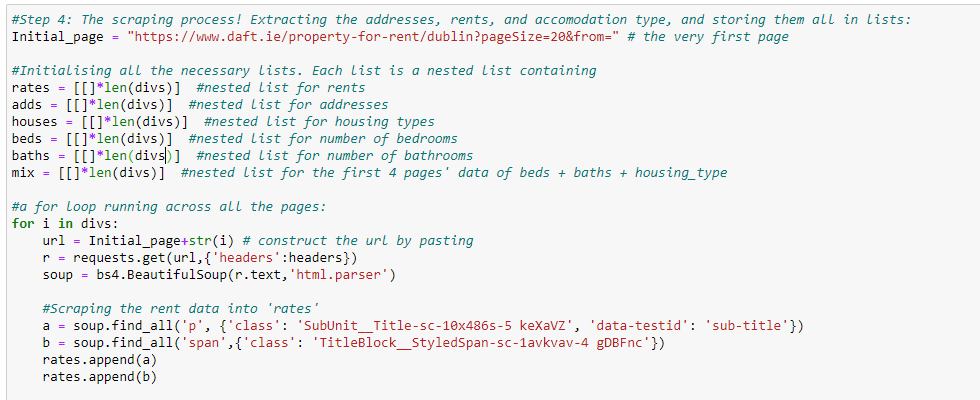
*Fig 4.1 - Scraping of data using functions from BeautifulSoup*

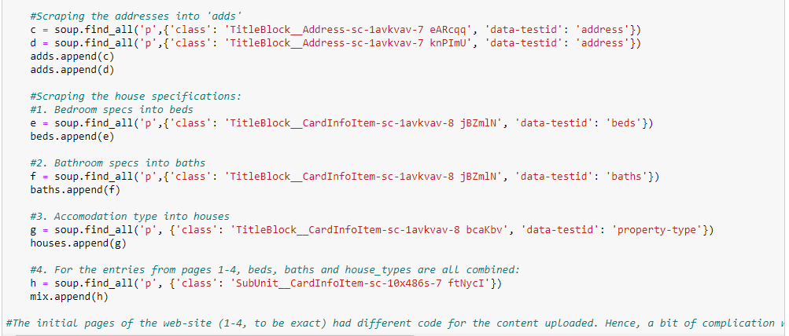
*Fig 4.2 - Scraping of data using functions from BeautifulSoup*

5. Each nested list is converted to a regular list for simplicity of usage.

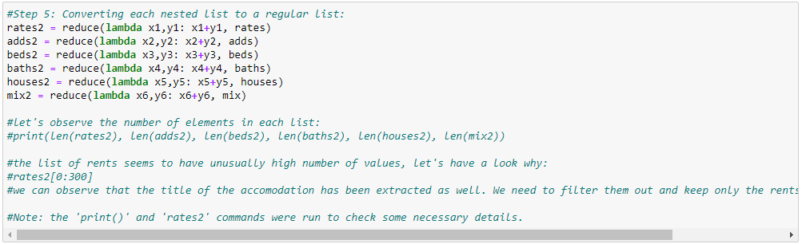
*Fig 5.1 - Consolidation of data into regular lists*

6. It can be observed that some entries contain unnecessary information that do not contribute to the required objective, but contain the same tags as the house rental rates. These data end up extracted and have to be removed.

*Fig 6.1 - The extra unnecessary data*

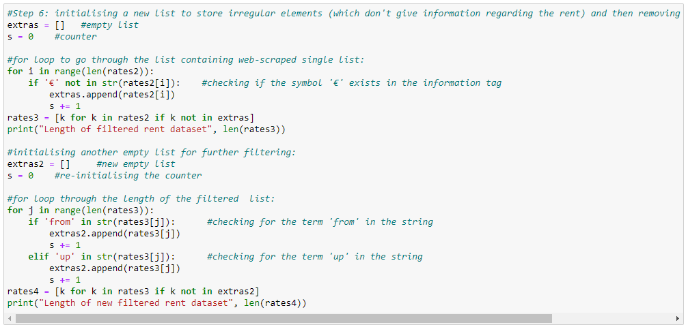
*Fig 6.2 - Removal of extra unnecessary data*

 7. The scraped data contains tags such as 
 and 
. To remove this, the data is further filtered to the text and appended into lists.

 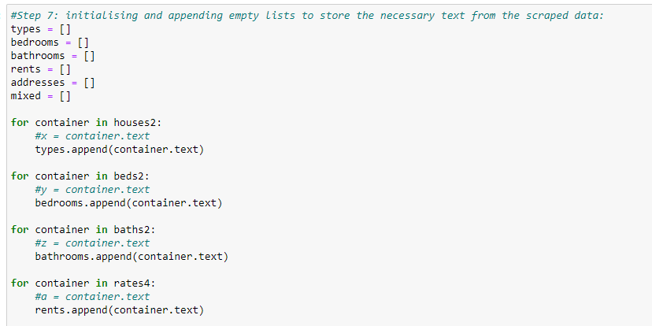
 *Fig 7.1 - Removal of HTML tags from the scraped data*

 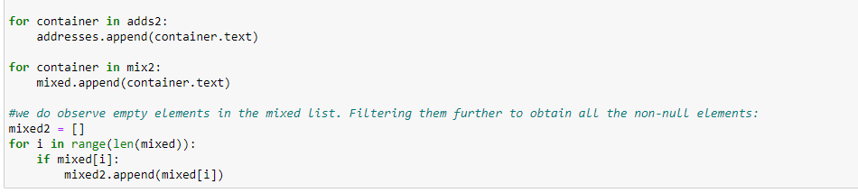
 *Fig 7.2 - Removal of HTML tags from the scraped data*

8. The data is now ready to be exported. This data requires further clean-up, which is easier to complete in MS Excel and then combined to one single dataset. This completes Part I of the web scraping process: Scraping of raw data from the web.

*Fig 8.1 - The filtered data is exported as .csv files*

9. The exported data are: House-rent prices, bedrooms, bathrooms, housing-type, address and mixed data (this contains combination of bedrooms, bathrooms and housing-type). Some of the data of bedrooms, bathrooms and housing-type which were entered recently were combined (no idea why). But it is possible to separate them in a sensible manner.

10. The House-rent prices, bedrooms and bathrooms datasets are simple to clean up and extract. The REPLACE() function is used to remove unnecessary characters from the elements of the .csv file. The LEFT() function is used to extract the housing-type, bedrooms, bathrooms from the mixed data file.

*Fig 10.1 - Extracting useful data from the raw scraped data*

11. The extracted useful data is combined in a excel file and imported into Python again.

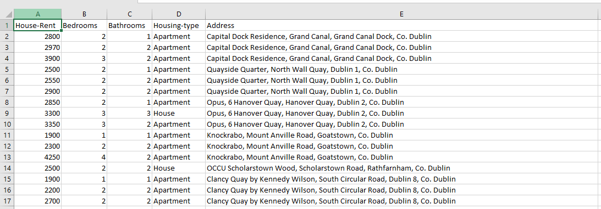
*Fig 11.1 - New cleaned-up data*

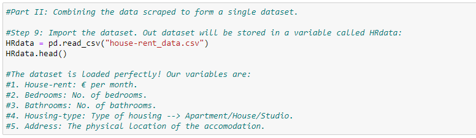
*Fig 11.2 - Importing the cleaned-up dataset*

12. The address column contains useful data, but for the data to be used in a prediction model this data has to be filtered properly. The localities are identified and the respective pin codes are assigned to each house according to their locality.

*Fig 12.1 - Cleaning up the address column to extract pin codes*
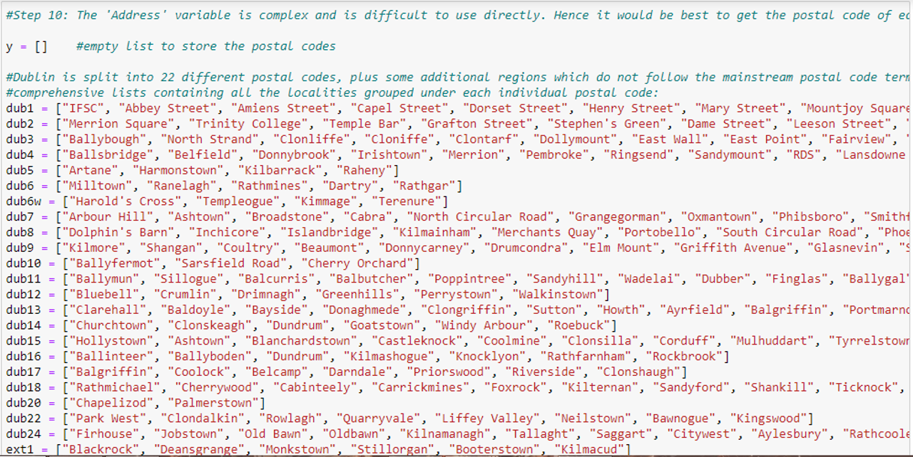
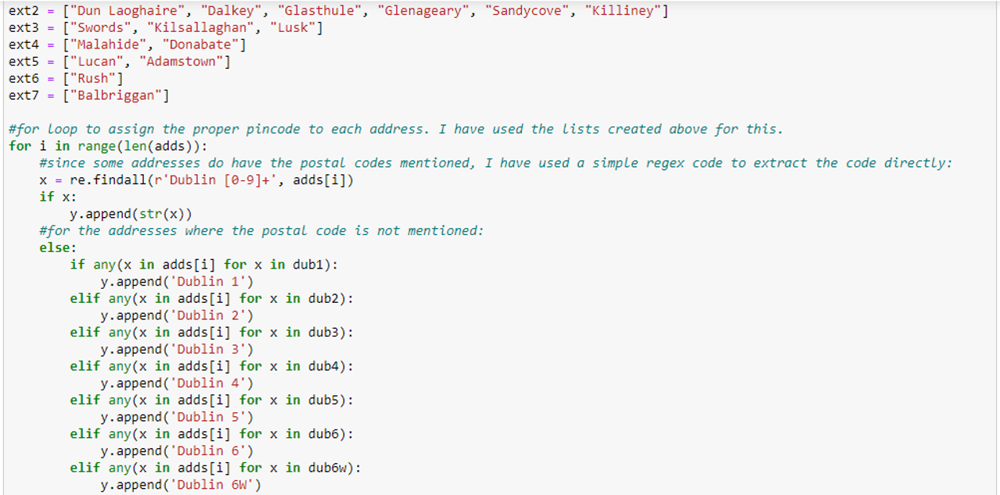
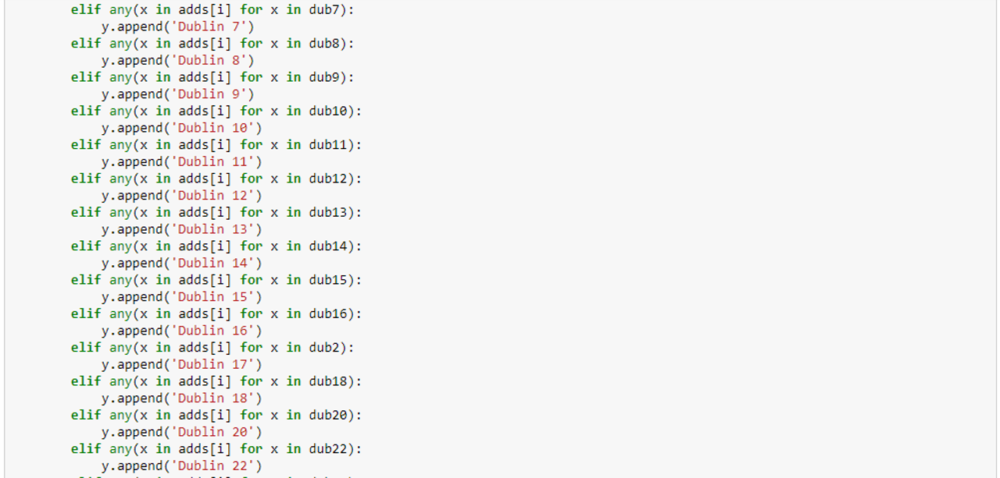
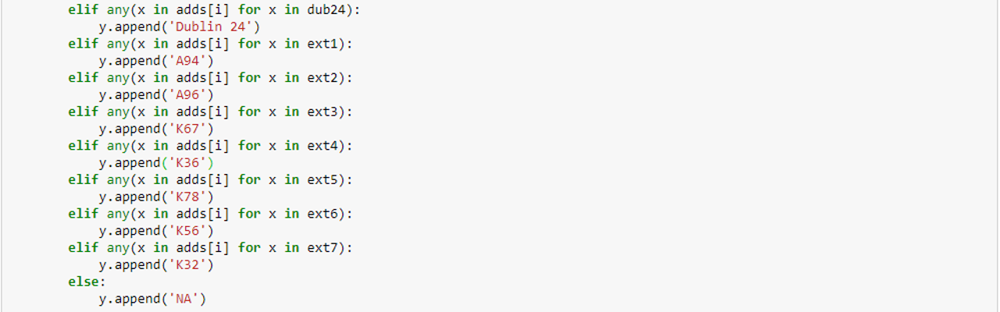

13. Finally, the postal code list is added to the dataframe and exported as our final clean dataset, which can be used for our predictive model in the future. This completes Part II of the web scraping process.

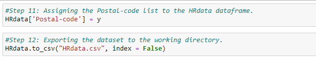
*Fig 13.1 - Exporting the final clean data*

##### V. Conclusion
Web-scraping is a useful and convenient way of collecting data for analysis. The use cases are innumerable and important. However, there is a potential of data privacy violation too, if not handled responsibly and properly. This activity has been a glimpse into what web-scraping can do and how it can be done. Also, this activity is a prequel to my next activity - House Rent prediction using Predictive Analytics.

Stay tuned!

Code uploaded on [GitHub](https://github.com/kiransid0205/My_projects/blob/main/web_scraping.ipynb)

Connect with me on [LinkedIn](https://www.linkedin.com/in/kiran-siddeshwar)!

Thank you!

Kiran Siddeshwar

